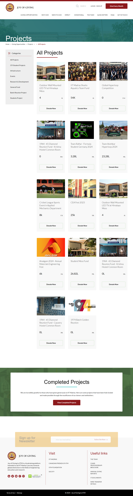

# IIT Madras Demo Project

## Home Page


## Projects Page




## Installation

Follow these instructions to set up and run the project locally on your Machine.

### Prerequisites

- [Git](https://git-scm.com/)
- [Composer](https://getcomposer.org/)
- [PHP](https://www.php.net/)

### Installation

1. Clone the repository:

```bash
   git clone https://github.com/karthikdemoiitmardas/IITMadrasDemoProject.git
```
 ```bash
   cd IITMadrasDemoProject
```

 ```bash
composer install
```
 ```bash
cp .env.example .env
```
```bash
php artisan key:generate
 ```
```bash
php artisan storage:link
```
 ```bash
 php artisan migrate:fresh --seed
```
 ```bash
 php artisan serve
```


# IITMadrasProject
